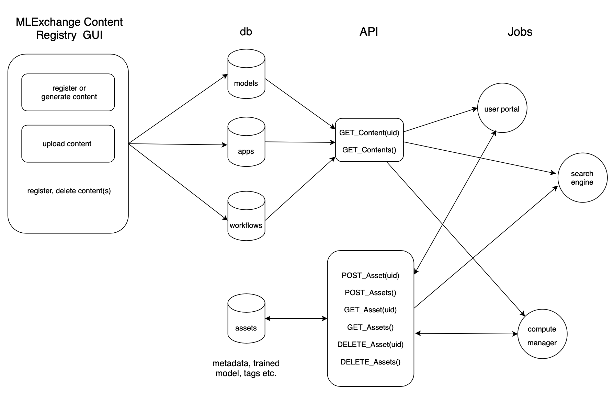

# MLExchange Content Registry
Content registry and its API for the MLExchange platform.
The architecture looks like below.

Contents include:  
	- models  
	- apps  
	- workflows  
	- assets (metadata, e.g., tags, trained models etc.) 
	- 

## How to use
Requirements: MLExchange compute_api

**Running content registry**   
`docker-compose up --build`

**Viewing existing contents**  
Scroll down to the bottom of the page, click on **Refresh** button.

**Delete existing contents**  
Select contents from the table and click **Delete** button.

**Modify existing contents**  
Currently, the **Modify** button is deprecated. 
Therefore, the easiest way to modify an existing registration is to delete the content, then either register a new content by filling out the forms or upload the revised JSON document again (drag and drop, click **Validate** button first, then click the **Upload** button).

## API calls
get\_models()  
get\_model(uid) 

get\_apps()  
get\_app(uid) 

get\_workflows()  
get\_workflow(uid) 

post\_assets(data)  
post\_asset(data) 
get\_assets()  
get\_asset(uid) 
delete\_assets(query)  
delete\_asset(uid) 

## Author
Name: [Zhuowen Zhao](https://github.com/zhuowenzhao) 
Correspondence: [zzhao2@lbl.gov](mailto:zzhao2@lbl.gov)  
Date: 10/21/2021  

## License
MLExchange Copyright (c) 2021, The Regents of the University of California,
through Lawrence Berkeley National Laboratory (subject to receipt of
any required approvals from the U.S. Dept. of Energy). All rights reserved.

Redistribution and use in source and binary forms, with or without
modification, are permitted provided that the following conditions are met:

(1) Redistributions of source code must retain the above copyright notice,
this list of conditions and the following disclaimer.

(2) Redistributions in binary form must reproduce the above copyright
notice, this list of conditions and the following disclaimer in the
documentation and/or other materials provided with the distribution.

(3) Neither the name of the University of California, Lawrence Berkeley
National Laboratory, U.S. Dept. of Energy nor the names of its contributors
may be used to endorse or promote products derived from this software
without specific prior written permission.

THIS SOFTWARE IS PROVIDED BY THE COPYRIGHT HOLDERS AND CONTRIBUTORS "AS IS"
AND ANY EXPRESS OR IMPLIED WARRANTIES, INCLUDING, BUT NOT LIMITED TO, THE
IMPLIED WARRANTIES OF MERCHANTABILITY AND FITNESS FOR A PARTICULAR PURPOSE
ARE DISCLAIMED. IN NO EVENT SHALL THE COPYRIGHT OWNER OR CONTRIBUTORS BE
LIABLE FOR ANY DIRECT, INDIRECT, INCIDENTAL, SPECIAL, EXEMPLARY, OR
CONSEQUENTIAL DAMAGES (INCLUDING, BUT NOT LIMITED TO, PROCUREMENT OF
SUBSTITUTE GOODS OR SERVICES; LOSS OF USE, DATA, OR PROFITS; OR BUSINESS
INTERRUPTION) HOWEVER CAUSED AND ON ANY THEORY OF LIABILITY, WHETHER IN
CONTRACT, STRICT LIABILITY, OR TORT (INCLUDING NEGLIGENCE OR OTHERWISE)
ARISING IN ANY WAY OUT OF THE USE OF THIS SOFTWARE, EVEN IF ADVISED OF THE
POSSIBILITY OF SUCH DAMAGE.
